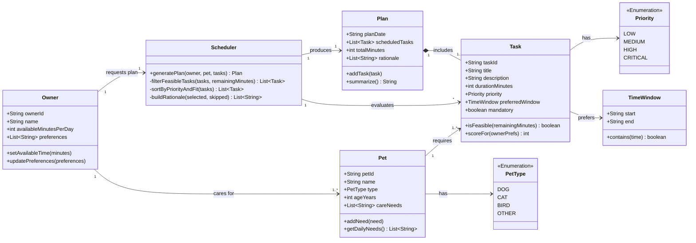

```mermaid
---
id: 9656975c-0db9-40c4-ba85-c7d91fbab1f3
---
classDiagram
    direction LR

    class Owner {
        +String ownerId
        +String name
        +int availableMinutesPerDay
        +List~String~ preferences
        +setAvailableTime(minutes)
        +updatePreferences(preferences)
    }

    class Pet {
        +String petId
        +String name
        +PetType type
        +int ageYears
        +List~String~ careNeeds
        +addNeed(need)
        +getDailyNeeds() List~String~
    }

    class Task {
        +String taskId
        +String title
        +String description
        +int durationMinutes
        +Priority priority
        +TimeWindow preferredWindow
        +boolean mandatory
        +isFeasible(remainingMinutes) boolean
        +scoreFor(ownerPrefs) int
    }

    class Scheduler {
        +generatePlan(owner, pet, tasks) Plan
        -filterFeasibleTasks(tasks, remainingMinutes) List~Task~
        -sortByPriorityAndFit(tasks) List~Task~
        -buildRationale(selected, skipped) List~String~
    }

    class Plan {
        +String planDate
        +List~Task~ scheduledTasks
        +int totalMinutes
        +List~String~ rationale
        +addTask(task)
        +summarize() String
    }

    class Priority {
        <<Enumeration>>
        LOW
        MEDIUM
        HIGH
        CRITICAL
    }

    class PetType {
        <<Enumeration>>
        DOG
        CAT
        BIRD
        OTHER
    }

    class TimeWindow {
        +String start
        +String end
        +contains(time) boolean
    }

    Owner "1" --> "1..*" Pet : cares for
    Pet "1" --> "1..*" Task : requires
    Owner "1" --> "1" Scheduler : requests plan
    Scheduler "1" --> "*" Task : evaluates
    Scheduler "1" --> "1" Plan : produces
    Plan "1" *-- "1..*" Task : includes
    Task --> Priority : has
    Pet --> PetType : has
    Task --> TimeWindow : prefers
```
